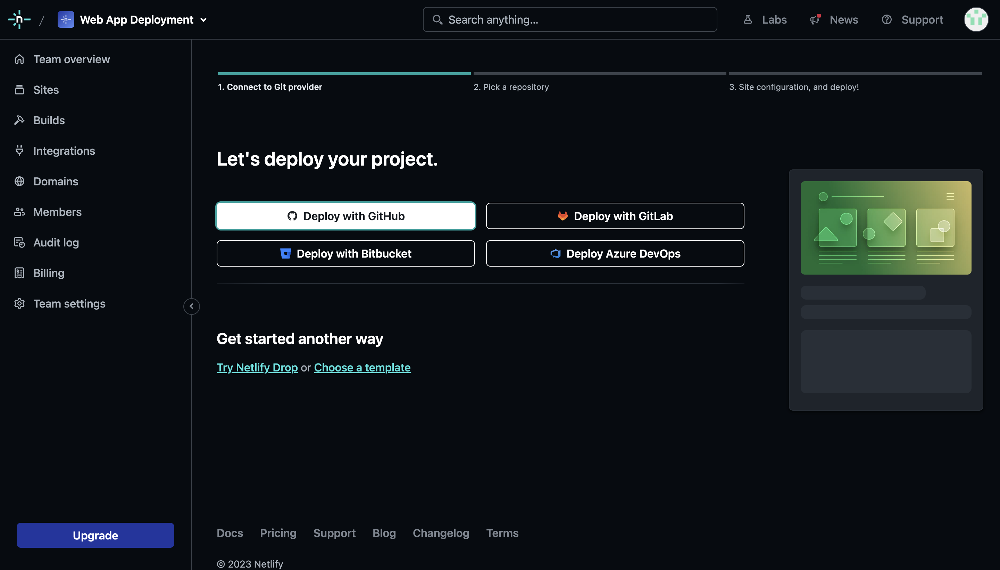

# Welcome to My Repository!
On this repository, I will tell you the process of creating Traveplan website, from creating the HTML to deploying Traveplan website with custom domain.

## Process of Building Traveplan Website
### 1. Creating HTML Files
 
First, I created HTML files to create the structure of the website.
Semantics elements is used on this HTML to improve the website.  
Here's the detail point of the improvement on HTML:
- Using heading tags to represent the hierarchy of headings.
- Use unordered list for navigation tab.
- Updating form content by using only important information for Contact Us form.
- Updating About us content to emphasize Traveplan strength.
- Enable link to specific section on the page by using anchor tags.

### 2. Improving website pages by using CSS
 
After the HTML is created, I'm using CSS to make the website visualization more attractive. 
Here are the detail point of the improvement on CSS:
- Using font face to use Roboto font.
- Using responsive design by setting the max width on 1077px.
- Changing the navigation tab by using hamburger button when the screen size is less than or equal to 1077px.
- Using grid on About Us section and Gallery section.
- Using animation and transition on the button and header text.
- Responsive image for the first picture on gallery when the screen size is less than or equal to 1077px.

### 3. Update the HTML and CSS file to GitHub Repository
 
 
After the HTML and CSS file is created, I push the file to the repository by using Github command on terminal and the file is successfully pushed to the repository.

### 4. Deploy the website using Netlify

 

 
The pictures above are the step by step of deploying website on Netlify directly from the GitHub Repository. 
Once user click deploy repository button, Netlify will processing to deploy the website to the production.

### 5. Change the site name with custom domain
 
After the website is successfully deployed, Netlify will give the website name with random site name.  
We can change the website name to our custom domain by clicking the Site Configuration > Domain Management > Domain > add new site.  

### 6. Change the DNS setting in Cloudflare
 
After setting the domain in Netlify, I'm setting the DNS record in Cloudflare because I'm using Cloudflare for the domain set up. 
I edited the content on first row in the picture by changing the content url to the random site name on Netlify.

### 7. The Deploy Process is Successfully Complete!
 
After the DNS Setting is complete, the website is successfully deployed and user are able to access the website using the custom domain : [traveplan.site](https://traveplan.site/)!